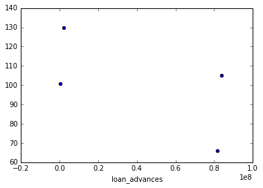

```python
#!/usr/bin/python

import sys
import pickle
sys.path.append("../tools/")

from feature_format import featureFormat, targetFeatureSplit
from tester import dump_classifier_and_data

### Load the dictionary containing the dataset
with open("final_project_dataset.pkl", "r") as data_file:
    data_dict = pickle.load(data_file)
    
for key in data_dict.keys():
    for value in data_dict[key]:
        print value
    break
```

    salary
    to_messages
    deferral_payments
    total_payments
    exercised_stock_options
    bonus
    restricted_stock
    shared_receipt_with_poi
    restricted_stock_deferred
    total_stock_value
    expenses
    loan_advances
    from_messages
    other
    from_this_person_to_poi
    poi
    director_fees
    deferred_income
    long_term_incentive
    email_address
    from_poi_to_this_person
    


```python
### Task 1: Select what features you'll use.
### features_list is a list of strings, each of which is a feature name.
### The first feature must be "poi".
features_list = ['poi']
for key in data_dict.keys():
    for value in data_dict[key]:
        if value in features_list:
            continue
        features_list.append(value)
    break

import pprint
pprint.pprint(features_list)
# You will need to use more features
```

    ['poi',
     'salary',
     'to_messages',
     'deferral_payments',
     'total_payments',
     'exercised_stock_options',
     'bonus',
     'restricted_stock',
     'shared_receipt_with_poi',
     'restricted_stock_deferred',
     'total_stock_value',
     'expenses',
     'loan_advances',
     'from_messages',
     'other',
     'from_this_person_to_poi',
     'director_fees',
     'deferred_income',
     'long_term_incentive',
     'email_address',
     'from_poi_to_this_person']
    


```python
features_list.remove('email_address')
pprint.pprint(features_list)
```

    ['poi',
     'salary',
     'to_messages',
     'deferral_payments',
     'total_payments',
     'exercised_stock_options',
     'bonus',
     'restricted_stock',
     'shared_receipt_with_poi',
     'restricted_stock_deferred',
     'total_stock_value',
     'expenses',
     'loan_advances',
     'from_messages',
     'other',
     'from_this_person_to_poi',
     'director_fees',
     'deferred_income',
     'long_term_incentive',
     'from_poi_to_this_person']
    


```python
for feature in features_list:
    cnt=0
    for key in data_dict.keys():
        if data_dict[key][feature] == 'NaN':
            cnt+=1
    print feature + " -> " + str(cnt)
```

    poi -> 0
    salary -> 51
    to_messages -> 60
    deferral_payments -> 107
    total_payments -> 21
    exercised_stock_options -> 44
    bonus -> 64
    restricted_stock -> 36
    shared_receipt_with_poi -> 60
    restricted_stock_deferred -> 128
    total_stock_value -> 20
    expenses -> 51
    loan_advances -> 142
    from_messages -> 60
    other -> 53
    from_this_person_to_poi -> 60
    director_fees -> 129
    deferred_income -> 97
    long_term_incentive -> 80
    from_poi_to_this_person -> 60
    


```python
%matplotlib inline
import matplotlib.pyplot as plt

for feature in features_list:
    maxi = 0
    cnt=0
    for key in data_dict:
        cnt+=1
        point=data_dict[key][feature]
        if point>maxi and point != 'NaN':
            maxi = point
            name = key
        plt.scatter(point, cnt)
    plt.xlabel(feature)
    plt.show()
    print name
    print maxi
    print "\n ------------------------------------------------------------------------------------ \n"

```


    HANNON KEVIN P
    True
    
     ------------------------------------------------------------------------------------ 
    
    


    TOTAL
    26704229
    
     ------------------------------------------------------------------------------------ 
    
    


    SHAPIRO RICHARD S
    15149
    
     ------------------------------------------------------------------------------------ 
    
    


    TOTAL
    32083396
    
     ------------------------------------------------------------------------------------ 
    
    


    TOTAL
    309886585
    
     ------------------------------------------------------------------------------------ 
    
    


    TOTAL
    311764000
    
     ------------------------------------------------------------------------------------ 
    
    


    TOTAL
    97343619
    
     ------------------------------------------------------------------------------------ 
    
    


    TOTAL
    130322299
    
     ------------------------------------------------------------------------------------ 
    
    


    BELDEN TIMOTHY N
    5521
    
     ------------------------------------------------------------------------------------ 
    
    


    BHATNAGAR SANJAY
    15456290
    
     ------------------------------------------------------------------------------------ 
    
    


    TOTAL
    434509511
    
     ------------------------------------------------------------------------------------ 
    
    


    TOTAL
    5235198
    
     ------------------------------------------------------------------------------------ 
    
    





    TOTAL
    83925000
    
     ------------------------------------------------------------------------------------ 
    
    


    KAMINSKI WINCENTY J
    14368
    
     ------------------------------------------------------------------------------------ 
    
    


    TOTAL
    42667589
    
     ------------------------------------------------------------------------------------ 
    
    


    DELAINEY DAVID W
    609
    
     ------------------------------------------------------------------------------------ 
    
    


    TOTAL
    1398517
    
     ------------------------------------------------------------------------------------ 
    
    


    TOTAL
    0
    
     ------------------------------------------------------------------------------------ 
    
    


    TOTAL
    48521928
    
     ------------------------------------------------------------------------------------ 
    
    


    LAVORATO JOHN J
    528
    
     ------------------------------------------------------------------------------------ 
    
    


```python
data_dict.pop('TOTAL')
```


    {'bonus': 97343619,
     'deferral_payments': 32083396,
     'deferred_income': -27992891,
     'director_fees': 1398517,
     'email_address': 'NaN',
     'exercised_stock_options': 311764000,
     'expenses': 5235198,
     'from_messages': 'NaN',
     'from_poi_to_this_person': 'NaN',
     'from_this_person_to_poi': 'NaN',
     'loan_advances': 83925000,
     'long_term_incentive': 48521928,
     'other': 42667589,
     'poi': False,
     'restricted_stock': 130322299,
     'restricted_stock_deferred': -7576788,
     'salary': 26704229,
     'shared_receipt_with_poi': 'NaN',
     'to_messages': 'NaN',
     'total_payments': 309886585,
     'total_stock_value': 434509511}


```python
for feature in features_list:
    maxi = 0
    cnt=0
    for key in data_dict:
        cnt+=1
        point=data_dict[key][feature]
        if point>maxi and point != 'NaN':
            maxi = point
            name = key
        plt.scatter(point, cnt)
    plt.xlabel(feature)
    plt.show()
    print name
    print maxi
    print "\n ------------------------------------------------------------------------------------ \n"

```


    HANNON KEVIN P
    True
    
     ------------------------------------------------------------------------------------ 
    
    


    SKILLING JEFFREY K
    1111258
    
     ------------------------------------------------------------------------------------ 
    
    


    SHAPIRO RICHARD S
    15149
    
     ------------------------------------------------------------------------------------ 
    
    


    FREVERT MARK A
    6426990
    
     ------------------------------------------------------------------------------------ 
    
    


    LAY KENNETH L
    103559793
    
     ------------------------------------------------------------------------------------ 
    
    


    LAY KENNETH L
    34348384
    
     ------------------------------------------------------------------------------------ 
    
    


    LAVORATO JOHN J
    8000000
    
     ------------------------------------------------------------------------------------ 
    
    


    LAY KENNETH L
    14761694
    
     ------------------------------------------------------------------------------------ 
    
    


    BELDEN TIMOTHY N
    5521
    
     ------------------------------------------------------------------------------------ 
    
    


    BHATNAGAR SANJAY
    15456290
    
     ------------------------------------------------------------------------------------ 
    
    


    LAY KENNETH L
    49110078
    
     ------------------------------------------------------------------------------------ 
    
    


    MCCLELLAN GEORGE
    228763
    
     ------------------------------------------------------------------------------------ 
    
    


    LAY KENNETH L
    81525000
    
     ------------------------------------------------------------------------------------ 
    
    


    KAMINSKI WINCENTY J
    14368
    
     ------------------------------------------------------------------------------------ 
    
    


    LAY KENNETH L
    10359729
    
     ------------------------------------------------------------------------------------ 
    
    


    DELAINEY DAVID W
    609
    
     ------------------------------------------------------------------------------------ 
    
    


    BHATNAGAR SANJAY
    137864
    
     ------------------------------------------------------------------------------------ 
    
    


    BHATNAGAR SANJAY
    0
    
     ------------------------------------------------------------------------------------ 
    
    


    MARTIN AMANDA K
    5145434
    
     ------------------------------------------------------------------------------------ 
    
    


    LAVORATO JOHN J
    528
    
     ------------------------------------------------------------------------------------ 
    
    


```python
for key in data_dict.keys():
    print key
```

    METTS MARK
    BAXTER JOHN C
    ELLIOTT STEVEN
    CORDES WILLIAM R
    HANNON KEVIN P
    MORDAUNT KRISTINA M
    MEYER ROCKFORD G
    MCMAHON JEFFREY
    HORTON STANLEY C
    PIPER GREGORY F
    HUMPHREY GENE E
    UMANOFF ADAM S
    BLACHMAN JEREMY M
    SUNDE MARTIN
    GIBBS DANA R
    LOWRY CHARLES P
    COLWELL WESLEY
    MULLER MARK S
    JACKSON CHARLENE R
    WESTFAHL RICHARD K
    WALTERS GARETH W
    WALLS JR ROBERT H
    KITCHEN LOUISE
    CHAN RONNIE
    BELFER ROBERT
    SHANKMAN JEFFREY A
    WODRASKA JOHN
    BERGSIEKER RICHARD P
    URQUHART JOHN A
    BIBI PHILIPPE A
    RIEKER PAULA H
    WHALEY DAVID A
    BECK SALLY W
    HAUG DAVID L
    ECHOLS JOHN B
    MENDELSOHN JOHN
    HICKERSON GARY J
    CLINE KENNETH W
    LEWIS RICHARD
    HAYES ROBERT E
    MCCARTY DANNY J
    KOPPER MICHAEL J
    LEFF DANIEL P
    LAVORATO JOHN J
    BERBERIAN DAVID
    DETMERING TIMOTHY J
    WAKEHAM JOHN
    POWERS WILLIAM
    GOLD JOSEPH
    BANNANTINE JAMES M
    DUNCAN JOHN H
    SHAPIRO RICHARD S
    SHERRIFF JOHN R
    SHELBY REX
    LEMAISTRE CHARLES
    DEFFNER JOSEPH M
    KISHKILL JOSEPH G
    WHALLEY LAWRENCE G
    MCCONNELL MICHAEL S
    PIRO JIM
    DELAINEY DAVID W
    SULLIVAN-SHAKLOVITZ COLLEEN
    WROBEL BRUCE
    LINDHOLM TOD A
    MEYER JEROME J
    LAY KENNETH L
    BUTTS ROBERT H
    OLSON CINDY K
    MCDONALD REBECCA
    CUMBERLAND MICHAEL S
    GAHN ROBERT S
    MCCLELLAN GEORGE
    HERMANN ROBERT J
    SCRIMSHAW MATTHEW
    GATHMANN WILLIAM D
    HAEDICKE MARK E
    BOWEN JR RAYMOND M
    GILLIS JOHN
    FITZGERALD JAY L
    MORAN MICHAEL P
    REDMOND BRIAN L
    BAZELIDES PHILIP J
    BELDEN TIMOTHY N
    DURAN WILLIAM D
    THORN TERENCE H
    FASTOW ANDREW S
    FOY JOE
    CALGER CHRISTOPHER F
    RICE KENNETH D
    KAMINSKI WINCENTY J
    LOCKHART EUGENE E
    COX DAVID
    OVERDYKE JR JERE C
    PEREIRA PAULO V. FERRAZ
    STABLER FRANK
    SKILLING JEFFREY K
    BLAKE JR. NORMAN P
    SHERRICK JEFFREY B
    PRENTICE JAMES
    GRAY RODNEY
    PICKERING MARK R
    THE TRAVEL AGENCY IN THE PARK
    NOLES JAMES L
    KEAN STEVEN J
    FOWLER PEGGY
    WASAFF GEORGE
    WHITE JR THOMAS E
    CHRISTODOULOU DIOMEDES
    ALLEN PHILLIP K
    SHARP VICTORIA T
    JAEDICKE ROBERT
    WINOKUR JR. HERBERT S
    BROWN MICHAEL
    BADUM JAMES P
    HUGHES JAMES A
    REYNOLDS LAWRENCE
    DIMICHELE RICHARD G
    BHATNAGAR SANJAY
    CARTER REBECCA C
    BUCHANAN HAROLD G
    YEAP SOON
    MURRAY JULIA H
    GARLAND C KEVIN
    DODSON KEITH
    YEAGER F SCOTT
    HIRKO JOSEPH
    DIETRICH JANET R
    DERRICK JR. JAMES V
    FREVERT MARK A
    PAI LOU L
    BAY FRANKLIN R
    HAYSLETT RODERICK J
    FUGH JOHN L
    FALLON JAMES B
    KOENIG MARK E
    SAVAGE FRANK
    IZZO LAWRENCE L
    TILNEY ELIZABETH A
    MARTIN AMANDA K
    BUY RICHARD B
    GRAMM WENDY L
    CAUSEY RICHARD A
    TAYLOR MITCHELL S
    DONAHUE JR JEFFREY M
    GLISAN JR BEN F
    


```python
data_dict.pop('THE TRAVEL AGENCY IN THE PARK')
```


    {'bonus': 'NaN',
     'deferral_payments': 'NaN',
     'deferred_income': 'NaN',
     'director_fees': 'NaN',
     'email_address': 'NaN',
     'exercised_stock_options': 'NaN',
     'expenses': 'NaN',
     'from_messages': 'NaN',
     'from_poi_to_this_person': 'NaN',
     'from_this_person_to_poi': 'NaN',
     'loan_advances': 'NaN',
     'long_term_incentive': 'NaN',
     'other': 362096,
     'poi': False,
     'restricted_stock': 'NaN',
     'restricted_stock_deferred': 'NaN',
     'salary': 'NaN',
     'shared_receipt_with_poi': 'NaN',
     'to_messages': 'NaN',
     'total_payments': 362096,
     'total_stock_value': 'NaN'}


```python
features_list.remove('restricted_stock_deferred')
features_list.remove('director_fees')
features_list.remove('loan_advances')
```


```python
for key in data_dict.keys():
    try:
        data_dict[key]['fraction_from_this_person_to_poi'] = float(data_dict[key]['from_this_person_to_poi']
                                                              )/data_dict[key]['from_messages']
    except:
        data_dict[key]['fraction_from_this_person_to_poi'] = 'NaN'
        
    try:
        data_dict[key]['fraction_from_poi_to_this_person'] = float(data_dict[key]['from_poi_to_this_person']
                                                              )/data_dict[key]['to_messages']
    except:
        data_dict[key]['fraction_from_poi_to_this_person'] = 'NaN'
```


```python
features_list.append('fraction_from_this_person_to_poi')
features_list.append('fraction_from_poi_to_this_person')
features_list.remove('from_this_person_to_poi')
features_list.remove('from_poi_to_this_person')
features_list.remove('from_messages')
features_list.remove('to_messages')
```


```python
pprint.pprint(features_list)
```

    ['poi',
     'salary',
     'deferral_payments',
     'total_payments',
     'exercised_stock_options',
     'bonus',
     'restricted_stock',
     'shared_receipt_with_poi',
     'total_stock_value',
     'expenses',
     'other',
     'deferred_income',
     'long_term_incentive',
     'fraction_from_this_person_to_poi',
     'fraction_from_poi_to_this_person']
    


```python
### Task 3: Create new feature(s)
### Store to my_dataset for easy export below.
my_dataset = data_dict

### Extract features and labels from dataset for local testing
data = featureFormat(my_dataset, features_list, sort_keys = True)
labels, features = targetFeatureSplit(data)
```


```python
print len(features)
print len(labels)
```

    143
    143
    


```python
print len(features[0])
print len(features[142])
print labels[0]
```

    14
    14
    0.0
    


```python
from sklearn.preprocessing import MinMaxScaler
scaler = MinMaxScaler()
features = scaler.fit_transform(features)
```


```python
from sklearn.feature_selection import SelectKBest
selection = SelectKBest(k=10)
features = selection.fit_transform(features, labels)
features_selected = selection.get_support(indices = True)
print selection.scores_
```

    [ 18.28968404   0.22461127   8.77277773  24.81507973  20.79225205
       9.21281062   8.58942073  24.18289868   6.09417331   4.18747751
      11.45847658   9.92218601  16.40971255   3.12809175]
    


```python
new_flist = ['poi']

for index in features_selected:
    new_flist.append(features_list[index + 1])
    
features_list = new_flist
print features_list
```

    ['poi', 'salary', 'total_payments', 'exercised_stock_options', 'bonus', 'restricted_stock', 'shared_receipt_with_poi', 'total_stock_value', 'deferred_income', 'long_term_incentive', 'fraction_from_this_person_to_poi']
    


```python
### Task 5: Tune your classifier to achieve better than .3 precision and recall 
### using our testing script. Check the tester.py script in the final project
### folder for details on the evaluation method, especially the test_classifier
### function. Because of the small size of the dataset, the script uses
### stratified shuffle split cross validation. For more info: 
### http://scikit-learn.org/stable/modules/generated/sklearn.cross_validation.StratifiedShuffleSplit.html

# Example starting point. Try investigating other evaluation techniques!
from sklearn.cross_validation import train_test_split
features_train, features_test, labels_train, labels_test = \
    train_test_split(features, labels, test_size=0.3, random_state=42)
```


```python
### Task 4: Try a varity of classifiers
### Please name your classifier clf for easy export below.
### Note that if you want to do PCA or other multi-stage operations,
### you'll need to use Pipelines. For more info:
### http://scikit-learn.org/stable/modules/pipeline.html

# Provided to give you a starting point. Try a variety of classifiers.
from sklearn.naive_bayes import GaussianNB
from sklearn.tree import DecisionTreeClassifier
from sklearn.svm import SVC
from sklearn.ensemble import AdaBoostClassifier
from sklearn.ensemble import RandomForestClassifier

#clf = RandomForestClassifier(n_estimators=5, max_depth=10)
#clf = AdaBoostClassifier(algorithm='SAMME', n_estimators=5)
clf = DecisionTreeClassifier(criterion='entropy', max_depth = 2)
#clf = GaussianNB()
#clf = SVC(kernel='rbf', C=10)

clf.fit(features_train, labels_train)
pred = clf.predict(features_test)
```


```python
from sklearn import metrics
print metrics.recall_score(labels_test, pred)
print metrics.accuracy_score(pred, labels_test)
print metrics.precision_score(labels_test, pred)
```

    0.8
    0.860465116279
    0.444444444444
    


```python
### Task 6: Dump your classifier, dataset, and features_list so anyone can
### check your results. You do not need to change anything below, but make sure
### that the version of poi_id.py that you submit can be run on its own and
### generates the necessary .pkl files for validating your results.

dump_classifier_and_data(clf, my_dataset, features_list)
```


```python
%run tester.py
```

    DecisionTreeClassifier(class_weight=None, criterion='entropy', max_depth=2,
                max_features=None, max_leaf_nodes=None, min_samples_leaf=1,
                min_samples_split=2, min_weight_fraction_leaf=0.0,
                presort=False, random_state=None, splitter='best')
    	Accuracy: 0.84340	Precision: 0.41947	Recall: 0.45450	F1: 0.43629	F2: 0.44703
    	Total predictions: 15000	True positives:  909	False positives: 1258	False negatives: 1091	True negatives: 11742
    
    
